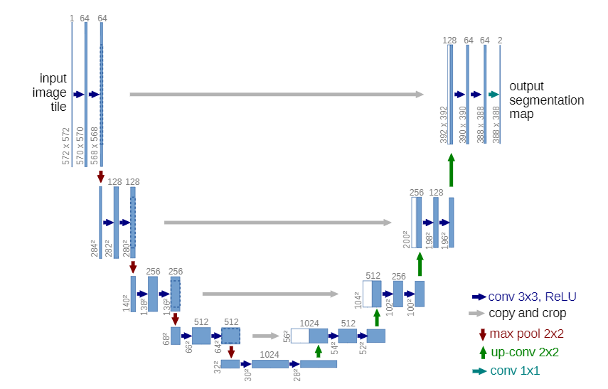

# U-Net
U-Net: Convolutional Networks for Biomedical Image Segmentation and more real world example 

implimenting U Net and than using the pretrained model for some applications 
mostly corona related because that what everyone talks about right now 

additionaly there is a lot of X-ray and CT scans are available [here](https://academictorrents.com/download/136ffddd0959108becb2b3a86630bec049fcb0ff.torrent)

## U-Net architecture

